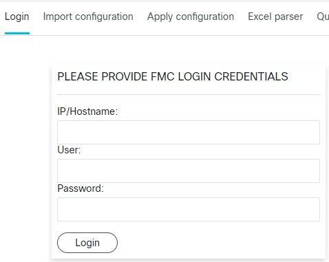

 

# fireAsACode

A tool to manage configuration of Cisco FMC in structured object format.

---

## Installing
There is a docker container already prepared. 
To download and run docker on your local PC please run:

```bash
docker run -d --name <docker_instance_name> -p 8443:443 -v <volume_name_for_configurations>:/fireAsACode/FMC_Configs rchrabas943/fireasacode
```

## Accessing the container:

Once you have docker running:
```bash
$ sudo docker ps
CONTAINER ID   IMAGE                     COMMAND              CREATED          STATUS          PORTS                                             NAMES
9ab7049fc5da   rchrabas943/fireasacode   "httpd-foreground"   13 minutes ago   Up 12 minutes   80/tcp, 0.0.0.0:8443->443/tcp, :::8443->443/tcp   faac
```
You can access GUI by: `https://127.0.0.1:8443`


# Menu options
To start using the tool you need to login to FMC first.

### Login
It will bring the login page where at any time you can login to desired FMC. - you need to have access to FMC API (TCP 443) from you local PC.
Once logged in, the tool will maintain the connectivity via API to selected FMC.
### Import configuration
Imports requested configuration from the FMC you connected to. 
### Apply configuration
It will apply the configuration saved in the folder to connected FMC. 
Full process requires 3 steps:
1. Loads configuration from provided folder - 
2. Compares loaded configuration (locally saved) to the configuration currently present on FMC.
3. Applies the changes. 
### Excel parser
Gives you ability to export JSON configuration to Excel and back to JSON.
### Query Editor
Provides ability to craft your own query.
### Configuration
Nrings the configuration page.

## Logging to FMC:
You need to provide valid credentials for the tool to be able to connect to FMC via API.



## Import configuration

Once pressing `Import configuration` button menu on the left will be shown.


1. You can provide won name of the folder where the configuration will be saved
2. Tool connected to the FMC and fetched initial data. You can select which object you want to fetch.
3. Imports the configuration. 

Example:
If you select host only in your configuration and Global domain only, `import` will do diff and fetch the host configuration for Global domain. Access Policy or Device configuration won't be fetch. 

Configuration will be saved in the provided folder.

Once the import is completed tool will print the result details:


Metadata will be saved in the folder, where the information about import request will be included:


## Apply configuration
1. Selecting the folder with the configuration to be loaded.
You need to select the locally saved configuration folder first:


Once the folder is selected, metadata is loaded.


You can limit the objects that will be loaded and later compared/applied. If the object type was not requested to be fetched from FMC, it will not be present on the list. 

2. Loading the configuration

Once the `Load` button was pressed the result of load will be printed:


The request for the `Load` will do diff between saved metadata and selected options. If there would be some objects loaded, you can proceed to `Compare`

3. Compare

There is `Include delete` button which will include and delete in `Apply` step the objects that haven't been present in JSON (locally saved configuration) but are present on FMC.

Note:
To show operation of the tool some modifications to FMC configuration were done.:
- Test_Host1 that has been saved in Backup_76_v1 configuration but the value was changed. (host should be updated)
- Test_Host2 that has been added to the configuration recently. (host should be deleted)

State 1: FMC state before importing configuration:


State 2: FMC state before appling the configuration:


Once pressing `Compare` button tool will initiate compare task.

The result will be printed what has to be changed to FMC to apply the configuration from Folder: `Backup_76_v1`


4. Apply

Once pressing `Apply` button tool will apply the tasks from the list of results of `Compare` task.


As the result, Test_Host1 should be updated - IP address revert to previous value and Test_Host2 should be deleted.
## Excel parser

#### Parse to Excel

1. Selecting the folder with the configuration to be loaded.
You need to select the locally saved configuration folder first:


Once the folder is selected, metadata is loaded.


Note: In this example, only hosts from Global will be parsed to Excel and saved in fireAsACode.xlsx file.

Once the loaded configuration was parsed, it would be saved to the folder and visible on the page for download:


We can now download the file and edit it in Excel:


Note: In this example, Test_Host1 IP was changed and new Test_Host3 object was added. 
Excel file was saved as `fireAsACode_NEW.xlsx` and can be now uploaded to the tool:


Once the file was uploaded, it should appear on the list of files available for parsing:


### Parse to JSON

Once the folder was selected, the list of available excel files will be listed:


`Include delete` check box will delete all JSON files in configuration folder if object tab was not present in Excel

Once `Parse from Excel` button was pushed the tool will parse the selected Excel file and save the result to the configuration folder. The result will be printed:


Note: If we compare the folder again the tool should discover changes to the configuration overwritten by Excel parser:


If we proceed with `Apply` the tool will apply the configuration changes made in Excel:


FMC configuration after apply for reference:


## Configuration

On the `Configuration` page you can select which types you would like to fetch from the FMC:


